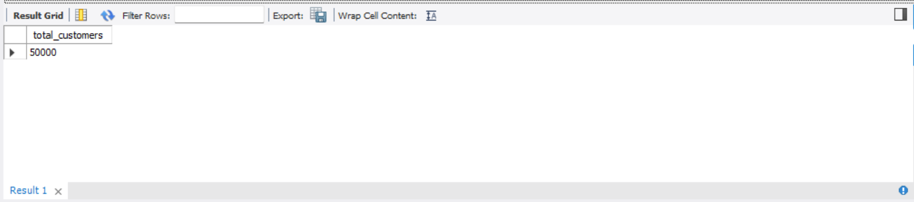
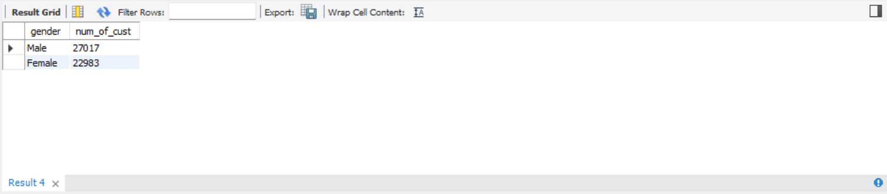
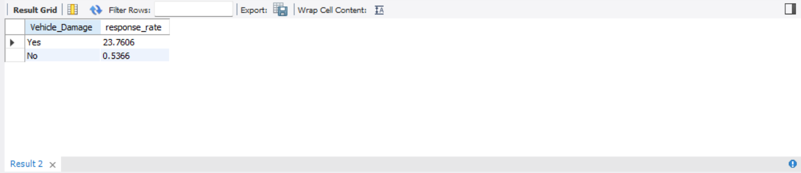
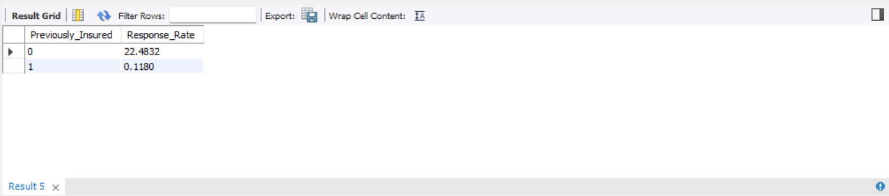
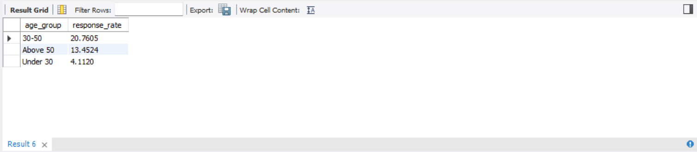
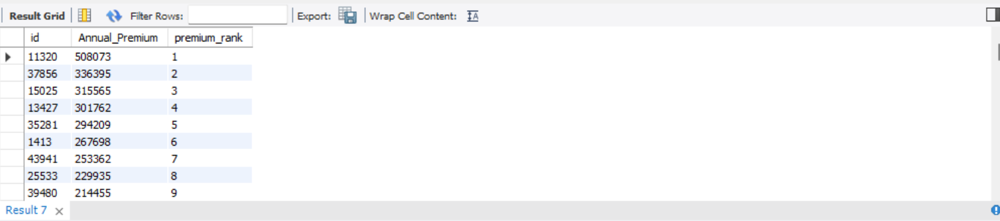

# **Insurance Customer Risk \& Cross-Sell Analytics using MySQL**

## Project Overview

This project analyzes 50,000 insurance customer records using MySQL to identify factors influencing customer interest in purchasing vehicle insurance. The analysis focuses on customer demographics, insurance history, vehicle characteristics, premium trends, and cross-sell opportunities.

## Dataset Information

The dataset contains information about:

\- Customer demographics (Age, Gender)

\- Vehicle information (Vehicle Age, Vehicle Damage)

\- Insurance history (Previously Insured)

\- Premium information (Annual Premium)

\- Sales channels

\- Customer response to insurance offers

Total Records Analyzed: 50,000

## Objectives

\- Understand customer demographics and insurance patterns

\- Analyze factors affecting insurance purchase decisions

\- Identify high-conversion customer segments

\- Explore premium distribution across customer groups

\- Generate business insights for cross-sell opportunities

## SQL Concepts Used

\- Data Aggregation (COUNT, AVG, SUM)

\- GROUP BY

\- CASE Statements

\- Common Table Expressions (CTEs)

\- Window Functions (RANK)

\- UNION

\- Data Exploration and Business Analysis

## Analysis Performed

### Data Exploration

\- Total customer count

\- Average customer age

\- Gender distribution

\- Age group segmentation

\- Previously insured customer analysis

\- Regional distribution analysis

### Business Analysis

\- Overall insurance conversion rate

\- Response rate by vehicle damage history

\- Response rate by previous insurance status

\- Response rate by age groups

\- Premium ranking analysis

\- Customer segmentation

## Key Insights

### 1. Vehicle Damage is the Strongest Predictor of Insurance Interest

Customers with a history of vehicle damage recorded a 23.76% response rate, compared to only 0.54% among customers without prior damage. This indicates that customers who have experienced vehicle damage are significantly more likely to purchase insurance products.

### 2. Previously Uninsured Customers Drive Cross-Sell Opportunities

Customers who were not previously insured showed a 22.48% response rate, while previously insured customers recorded a response rate of just 0.12%. This suggests that the highest conversion potential lies among customers who do not already hold insurance coverage.

### 3. Middle-Aged Customers Show the Highest Purchase Intent

Customers aged 30–50 years demonstrated the highest response rate at 20.76%, outperforming customers above 50 years (13.45%) and customers under 30 years (4.11%). This highlights the importance of age-based targeting in insurance marketing campaigns.

### 4. Balanced Customer Demographics

The dataset consisted of 50,000 customers, including 27,017 male customers and 22,983 female customers, providing a balanced demographic base for analysis and reducing gender-based sampling bias.

### 5. High-Value Premium Segments Identified

Using SQL window functions (`RANK()`), customers with annual premiums exceeding ₹500,000 were identified as the highest-value policyholders, enabling prioritization for premium product offerings and customer retention strategies.

## Project Summary

This project analyzed 50,000 insurance customer records using MySQL to identify key drivers of insurance purchase behavior. Through data exploration, customer segmentation, Common Table Expressions (CTEs), window functions, and business-focused SQL analysis, actionable insights were generated to support customer targeting, cross-selling strategies, and insurance risk assessment.

## Dataset Overview

### Total Customers

---

### Gender Distribution

---

### Vehicle Damage vs Response Rate

Customers with prior vehicle damage recorded significantly higher insurance purchase intent.

---

### Previously Insured vs Response Rate

Previously uninsured customers demonstrated the highest conversion potential.

---

### Response Rate by Age Group

Customers aged 30–50 exhibited the highest response rates.

---

### Premium Ranking using Window Functions

## Files Included

\- `schema.sql` – Database schema

\- `Insurance-Cross-Sell-Analytics.sql` – SQL queries used for analysis

\- `train.csv` – Dataset used for analysis

\- `screenshots/` – Query outputs and findings

\- `README.md` – Project documentation

## Tools Used

\- MySQL

\- MySQL Workbench

## Author

Aryan Kalra

